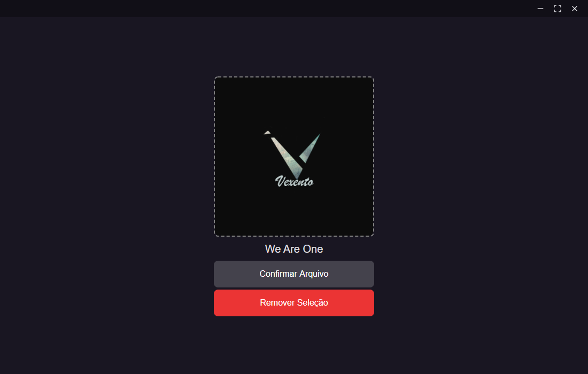

# 🎵 Harmonist - Desktop Application

Harmonist is a application that helps you editing metadata from audio files.

<p align="center">
  
</p>

## 📂 Boilerplate

Boilerplate for a project using Electron, React and Typescript

- [diego3g/electron-typescript-react](https://github.com/diego3g/electron-typescript-react)

## 🏃 Getting Started

First, clone this respository and access the created folder:

```bash
# Cloning repository
git clone https://github.com/iamtheluiz/harmonist.git

cd harmonist/
```

Getting into the folder, install project dependencies:

```bash
npm install
# or
yarn install
```

## 👨🏽‍💻 Usage

In order to run this project 2 scripts will need to be executed `dev:react` and `dev:electron`, run each one in a different terminal and always run `dev:react` before `dev:electron`.

```bash
npm run dev:react

npm run dev:electron
```

## ⚙️ Build

To build this project, run:

```bash
yarn build
```

## 💼 Authors

* **Luiz Gustavo** - *Development* - [iamtheluiz](https://github.com/iamtheluiz)

## 📃 License

This project is under the MIT License - see the [LICENSE](LICENSE) file for details.
